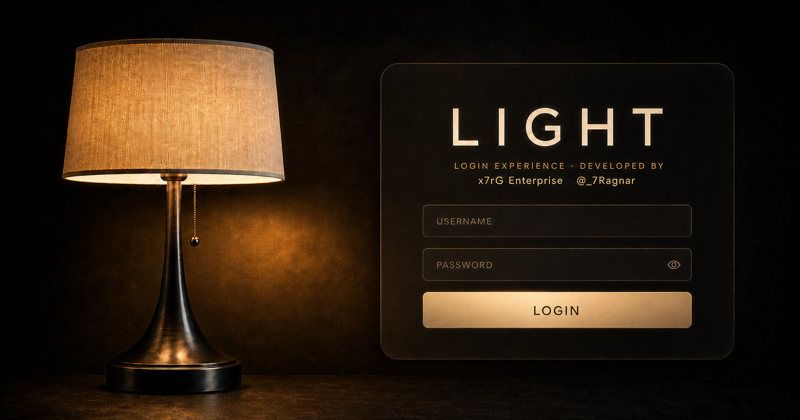
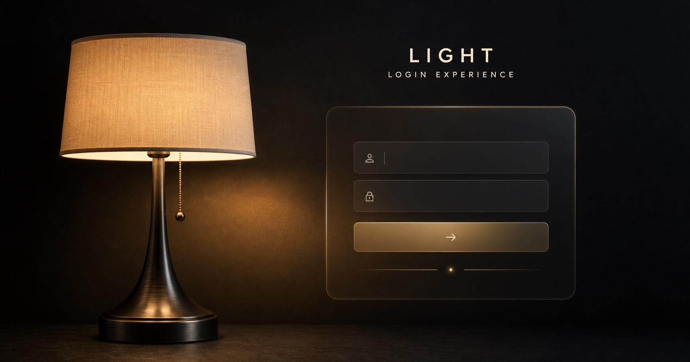

<div align="center">


# LIGHT — Login Experience

Uma experiência de login imersiva em que a luz deixa de ser apenas estética e
passa a controlar a interface.


**[Ver experiência publicada](https://ligth-login-x7rg.contato-rgsantos.workers.dev)**

</div>



## Sobre o projeto

O **LIGHT** é um conceito de interface que transforma uma tela de login em uma
pequena experiência sensorial. O usuário acende ou apaga o abajur pelo cordão e
a iluminação da cena responde junto com o formulário, as sombras, os movimentos
e os sons.

O projeto foi criado como uma demonstração de front-end e design de interação.
Ele não depende de backend para funcionar e pode ser publicado como site
estático no GitHub Pages.

> O formulário é demonstrativo: nenhum e-mail ou senha é enviado ou armazenado.

## Apresentação visual

<table>
  <tr>
    <td width="50%" align="center">
      
      <br />
      <sub><strong>Interface minimalista</strong> — foco na luz, no formulário e no contraste.</sub>
    </td>
    <td width="50%" align="center">
      
      <br />
      <sub><strong>Direção visual</strong> — acabamento premium em tons de preto, bronze e dourado.</sub>
    </td>
  </tr>
</table>


<p align="center">
  <sub><strong>Cena-base</strong> — composição preparada para receber formulário, cordão interativo, estados de luz e efeitos.</sub>
</p>

## Principais recursos

- Abajur interativo com estados de luz ligada e desligada.
- Cordão controlado por clique, toque, arraste ou teclado.
- Movimento pendular com ângulo e comprimento calculados em tempo real.
- Transições de brilho, saturação, sombra e visibilidade sincronizadas.
- Sons sintetizados no navegador, sem depender de arquivos de áudio externos.
- Resposta sonora diferente para cordão, interruptor, sucesso e erro.
- Formulário com validação nativa de e-mail e senha mínima.
- Confirmação visual e sonora após o envio demonstrativo.
- Layout adaptável para desktop, tablet e celular.
- Navegação por teclado e suporte à preferência de movimento reduzido.
- Metadados Open Graph e Twitter Card para compartilhamento.
- Exportação estática e publicação automática pelo GitHub Actions.

## Tecnologias utilizadas

| Tecnologia | Aplicação no projeto |
| --- | --- |
| **Next.js 16** | Estrutura da aplicação, metadados, otimização e exportação estática. |
| **React 19** | Componentes, estados da luz, interação do cordão e resposta do formulário. |
| **TypeScript 5** | Tipagem dos eventos, referências, estilos dinâmicos e regras de interação. |
| **CSS responsivo** | Iluminação, glassmorphism, animações, cordão, formulário e adaptação de orientação. |
| **Tailwind CSS 4 / PostCSS** | Pipeline moderno de processamento e geração dos estilos. |
| **Web Audio API** | Síntese dos efeitos sonoros diretamente no navegador. |
| **GitHub Actions** | Build automatizado e entrega do conteúdo estático. |
| **GitHub Pages** | Hospedagem gratuita da versão de produção. |

## Como a experiência funciona

1. A página inicia com a cena iluminada e o formulário disponível.
2. O usuário toca, clica ou arrasta o cordão do abajur.
3. O React atualiza o estado da luz e as variáveis CSS do pêndulo.
4. O CSS sincroniza imagem, sombra, formulário e animação.
5. A Web Audio API cria o som adequado para cada ação.
6. Ao enviar campos válidos, a interface apresenta uma confirmação local.

## Responsividade e acessibilidade

A composição mantém a proporção cinematográfica em telas horizontais. Em telas
verticais, uma media query reposiciona a cena, amplia a arte e move o formulário
para uma área confortável de leitura, evitando deformação do abajur.

O controle do cordão possui nome acessível, estado `aria-pressed`, foco visível e
suporte a teclado. Campos têm rótulos para leitores de tela, mensagens usam
`role="status"` e animações são praticamente desativadas quando o dispositivo
está configurado com `prefers-reduced-motion`.

## Executar localmente

### Requisitos

- Node.js 22.13 ou superior.
- npm 10 ou superior.

### Instalação

```bash
git clone https://github.com/xx7rg/LIGHT-Login-Experience.git
cd LIGHT-Login-Experience
npm install
npm run dev
```

Abra [http://localhost:3000](http://localhost:3000) no navegador.

## Comandos disponíveis

| Comando | Função |
| --- | --- |
| `npm run dev` | Inicia o ambiente local de desenvolvimento. |
| `npm run lint` | Verifica padrões de código, React e acessibilidade. |
| `npm run build` | Valida TypeScript e gera a versão estática em `out/`. |
| `npm run start` | Inicia o servidor Next.js quando aplicável. |

## Estrutura do projeto

```text
LIGHT-Login-Experience/
├── .github/workflows/       # Publicação automática no GitHub Pages
├── app/
│   ├── globals.css          # Visual, animações e responsividade
│   ├── layout.tsx           # Metadados sociais e estrutura HTML
│   └── page.tsx             # Interface, estados, eventos e áudio
├── docs/                    # Documentação técnica e apresentação
├── public/                  # Cena, imagens sociais e favicon
├── next.config.ts           # Exportação estática e basePath
├── package.json             # Dependências e comandos
└── tsconfig.json            # Configuração TypeScript
```

## Publicação

O workflow em `.github/workflows/deploy-pages.yml` executa automaticamente:

1. instalação limpa com `npm ci`;
2. build de produção com o caminho correto do repositório;
3. envio da pasta `out/`;
4. publicação no GitHub Pages.

No GitHub, configure **Settings → Pages → Source** como **GitHub Actions**. Cada
push na branch `main` publicará uma nova versão.

## Documentação

- [Documentação técnica](docs/DOCUMENTACAO_TECNICA.md)
- [Descrição e apresentação para o GitHub](docs/APRESENTACAO_GITHUB.md)

## Limites desta versão

Esta versão valida e simula o envio somente no navegador. Para uso real, ainda
seria necessário integrar um serviço de autenticação, criar tratamento seguro
de sessão, definir recuperação de senha e proteger as rotas privadas.

## Autoria

Desenvolvido por **x7rG Enterprise** — [@_7Ragnar](https://www.instagram.com/_7ragnar/) · [LinkedIn](https://www.linkedin.com/in/rgds/)

---

<p align="center">LIGHT — luz, movimento e som aplicados a uma experiência de acesso.</p>
